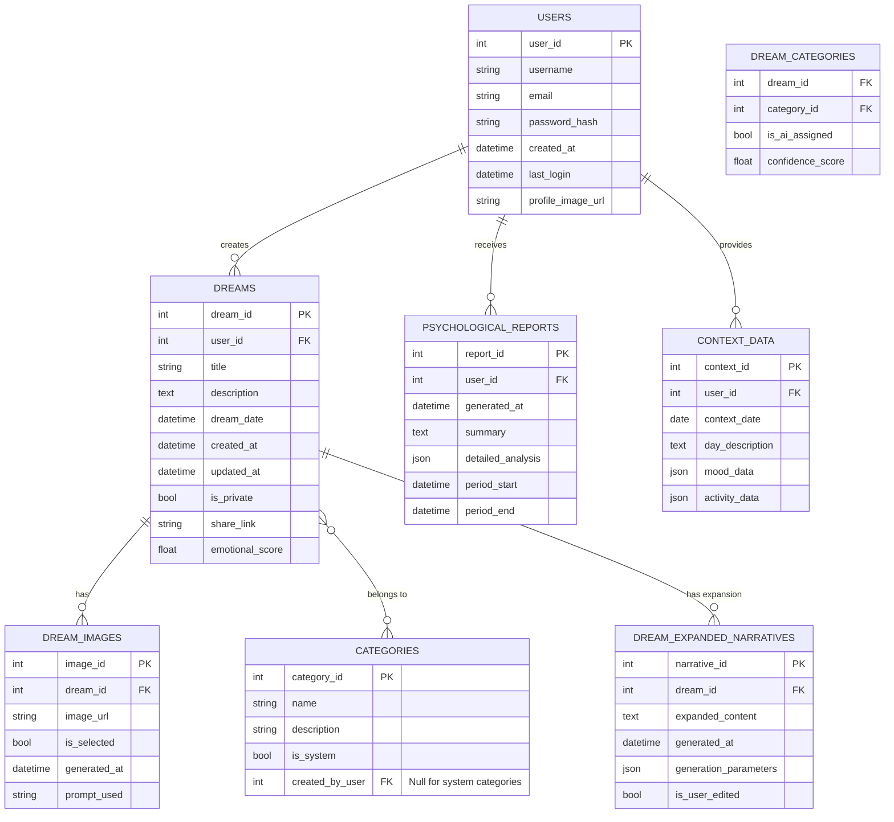

# DreamsWithAI

```mermaid
    erDiagram
    USERS {
        int user_id PK
        string username
        string email
        string password_hash
        datetime created_at
        datetime last_login
        string profile_image_url
    }
    DREAMS {
        int dream_id PK
        int user_id FK
        string title
        text description
        datetime dream_date
        datetime created_at
        datetime updated_at
        bool is_private
        string share_link
        float emotional_score
    }
    
    DREAM_IMAGES {
        int image_id PK
        int dream_id FK
        string image_url
        bool is_selected
        datetime generated_at
        string prompt_used
    }
    
    CATEGORIES {
        int category_id PK
        string name
        string description
        bool is_system
        int created_by_user FK "Null for system categories"
    }
    
    DREAM_CATEGORIES {
        int dream_id FK
        int category_id FK
        bool is_ai_assigned
        float confidence_score
    }
    
    PSYCHOLOGICAL_REPORTS {
        int report_id PK
        int user_id FK
        datetime generated_at
        text summary
        json detailed_analysis
        datetime period_start
        datetime period_end
    }
    
    CONTEXT_DATA {
        int context_id PK
        int user_id FK
        date context_date
        text day_description
        json mood_data
        json activity_data
    }
    
    DREAM_EXPANDED_NARRATIVES {
        int narrative_id PK
        int dream_id FK
        text expanded_content
        datetime generated_at
        json generation_parameters
        bool is_user_edited
    }
    
    USERS ||--o{ DREAMS : "creates"
    DREAMS ||--o{ DREAM_IMAGES : "has"
    DREAMS }o--o{ CATEGORIES : "belongs to"
    USERS ||--o{ PSYCHOLOGICAL_REPORTS : "receives"
    USERS ||--o{ CONTEXT_DATA : "provides"
    DREAMS ||--o{ DREAM_EXPANDED_NARRATIVES : "has expansion"

```
